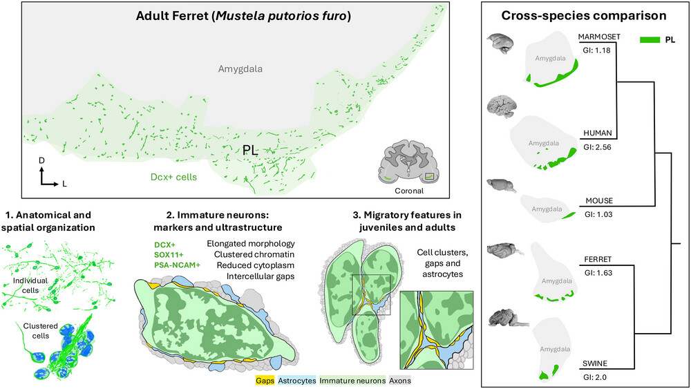

<figure style="text-align: center; margin: 2rem 0;">
  
  <figcaption style="font-size: 0.9em; color: #555; margin-top: 0.8rem; text-align: justify;">
    Left: Schematic of a coronal section of the adult ferret brain, showing the location of a collection of Dcx+ cells (green) ventrally to the amygdala (grey) in a region homologous to the PL in other species. These cells are spatially distributed either as individual cells in a dispersed field or in clusters (1). Cells in the ferret PL display molecular (Dcx, Sox11, and PSA-NCAM positive) and ultrastructural features of immature neurons (2). In both juveniles and adults, a subset of PL neurons shows morphological and ultrastructural features of migratory neurons, being surrounded by intercellular gaps (yellow) and astrocyte expansions (blue) that partially isolated clustered cells (3). Right: Phylogenetic tree comparing the PL (green) location across a range of species (marmoset, human, mouse, ferret, swine) with varying brain size and gyrification index (GI). Brains and schematic drawings of the amygdala are not in scale. D: dorsal, Dcx: doublecortin, L: lateral, PL: paralaminar nuclei. Brains of mouse, marmoset, ferret, swine, and human were reproduced from the Comparative Mammalian Brain Collections (https://brainmuseum.org/).
  </figcaption>
</figure>

We are pleased to share our new article published in *Journal of Comparative Neurology*.

In this study, we identify immature excitatory neurons in the postnatal ferret amygdala and compare their organization across mammalian species. We show that immature neurons extend into the amygdala not only in ferret, but also in marmoset and swine, supporting the idea that protracted maturation of paralaminar neurons is a conserved mammalian feature rather than a primate-specific specialization.

This work was carried out in close collaboration with the laboratories of Shawn Sorrells at the University of Pittsburgh and Arturo Alvarez-Buylla at UCSF.

We are especially proud that the first author of the paper is Lucía Inés Torrijos-Saiz. Her PhD thesis, defended in July 2025, brought together a substantial part of the results presented in this article.

This study also has a special meaning for us because it contributes to a comparative and developmental view of prolonged neuronal maturation in the amygdala, a topic central to our research interests.

**Reference**  
Torrijos-Saiz LI, Ghibaudi M, Sharief M, Ljungqvist Brinson L, Alvarez-Buylla A, García-Verdugo JM, Herranz-Pérez V, Sorrells S. *Immature excitatory neurons in the postnatal ferret paralaminar nuclei and their relationship to the amygdala across species*. *Journal of Comparative Neurology* (2026). DOI: [10.1002/cne.70155](https://doi.org/10.1002/cne.70155)