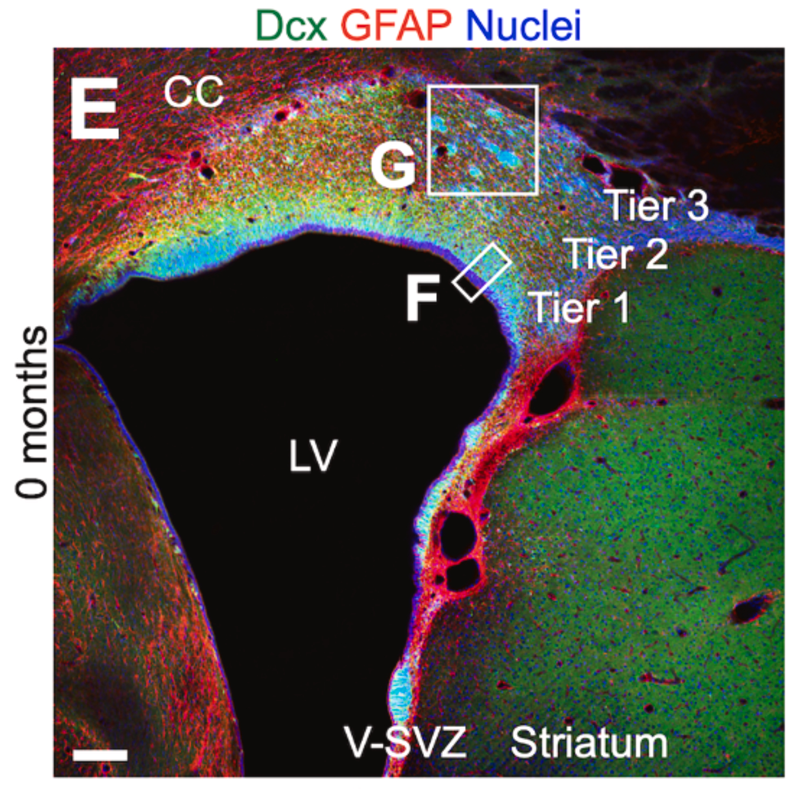

<figure style="text-align: center; margin: 2rem 0;">
  
  <figcaption style="font-size: 0.9em; color: #555; margin-top: 0.8rem; text-align: justify;">
    Cellular organization of the neonatal ventricular-subventricular zone (V-SVZ) in the neonatal microminipig brain.
</figure>

We are pleased to share our latest article, published in *Stem Cell Reports*.

In this study, we provide an ultrastructural and three-dimensional characterization of the postnatal ventricular–subventricular zone (V-SVZ) in the brain of the microminipig, the smallest pig strain currently available. Using transmission electron microscopy and serial block-face scanning electron microscopy, we reconstruct in fine detail the cytoarchitecture of this neurogenic niche and the organization of migrating neuroblasts across the neonatal, juvenile, and adult stages.

We show that the microminipig V-SVZ displays a layered organization comparable to that described in other gyrencephalic species, with distinct tiers harbouring dense neuroblast populations and characteristic cell clusters. At the ultrastructural level, neuroblasts exhibit the hallmarks of migrating cells: an elongated morphology, a polarized distribution of organelles, and leading processes tipped with growth cones.

A key finding of this work is that neuroblasts assemble into elongated, chain-like clusters rather than spherical aggregates. Three-dimensional reconstructions show that these chains are frequently aligned along blood vessels, with neuroblasts maintaining dynamic contacts with vascular and glial elements. This arrangement supports the view that blood vessels act as structural scaffolds guiding directional migration.

Importantly, our data uncover a developmental shift in migratory mechanisms. During early postnatal stages, neuroblast migration is closely associated with radial glial processes, which provide radial guidance. As development proceeds, radial glia gradually disappear and vascular scaffolds become the predominant substrate for migration. This transition illustrates how changes in the microenvironment shape distinct migratory behaviours over time.

Taken together, these results offer a detailed view of how neuroblast migration is organized in a gyrencephalic brain and reveal conserved cellular mechanisms underlying neuronal migration across species.
This work was led by the groups of Kazunobu Sawamoto (Nagoya City University) and Naoko Kaneko (Doshisha University), to whom the main credit for this project belongs. We have been collaborating with them for more than a decade and, beyond being outstanding scientists, they are also close friends. We are truly grateful to be part of this work.

This study is also dedicated to the memory of José Manuel García-Verdugo, our mentor and colleague, whose work laid the foundations of our understanding of the V-SVZ and neuroblast migration.

**Reference**  
Kojima D, Sawada M, Ishimaru T, Ito N, Tateyama S, Adachi K, Kawaguchi H, Satake N, Herranz-Pérez V, García-Verdugo JM, Hirose Y, Ohno N, Kaneko N, Sawamoto K. *Cytoarchitecture of neurogenic niche and neuroblast clusters in the postnatal microminipig brain*. *Stem Cell Reports* (2026). DOI: https://doi.org/10.1016/j.stemcr.2026.102893
