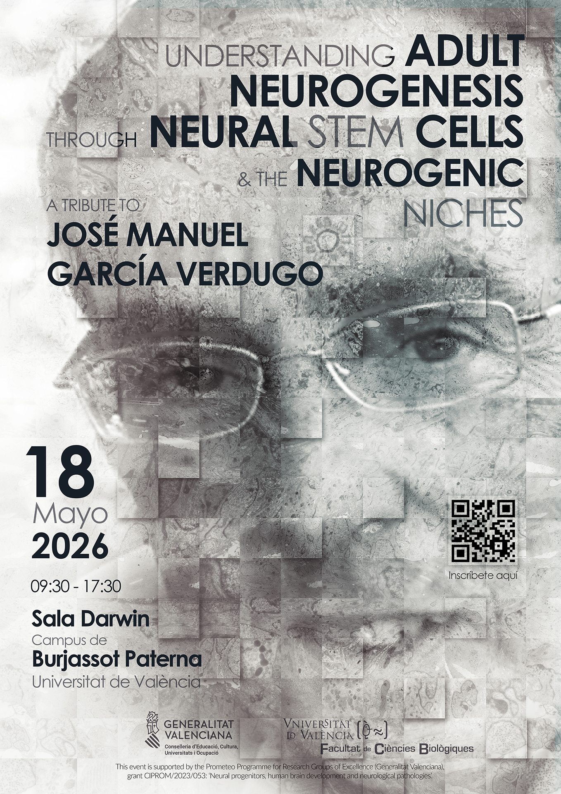

<figure style="text-align: center; margin: 2rem 0;">
  
</figure>

On May 18, 2026, Darwin Hall at the Burjassot Campus of the Universitat de València will host a tribute to José Manuel García Verdugo, Emeritus Professor at the Universitat de València and a leading figure in the field of neurobiology.

The event, entitled **“Understanding Adult Neurogenesis through Neural Stem Cells and Their Niches: A Tribute to José Manuel García Verdugo”**, will bring together personal remembrance and a scientific program devoted to adult neurogenesis, neural stem cells, and neurodevelopment, fields in which García Verdugo left an internationally recognized legacy.

Some of his closest collaborators, from Spanish and international research institutions, will take part in the event, speaking both about his scientific work and about the personal and professional relationship they shared with him. There will also be a space to remember his human legacy and the influence he had on several generations of researchers.

José Manuel García Verdugo (1953–2025) spent much of his career at the Universitat de València, where he was Professor in the Department of Cell Biology, Functional Biology and Physical Anthropology, and maintained his laboratory at the Cavanilles Institute of Biodiversity and Evolutionary Biology. He was one of the pioneers in the study of neurogenesis in the adult brain, and his work was decisive in identifying and characterizing neural stem cells and describing the architecture of neurogenic niches. Throughout his career, he maintained an intense research activity and trained many students and researchers, leaving behind a scientific school in this field.

Attendance is open, but prior registration is required, free of charge, in order to manage the capacity of the venue.

**Registration is available through the following link:**  
[Register for the symposium](https://docs.google.com/forms/d/e/1FAIpQLSd9-LR83bmfyN7HMx3VwXmO8pjkdfHKaIbyUch5ZNiovvEonA/viewform?usp=publish-editor)

## Program

**Darwin Hall, Burjassot Campus, Universitat de València**  
**Monday, May 18, 2026**

### Morning

**9:15 – 9:30** | Registration

**9:30 – 9:55** | Institutional Opening  
Dr. Ismael Mingarro Muñoz, Dean, Faculty of Biological Sciences  
Dr. Enrique Font Bisier, Cavanilles Institute of Biodiversity and Evolutionary Biology

**10:00 – 10:40** | Opening Lecture  
Dr. Arturo Álvarez-Buylla, UCSF  
*“Remembering a cherished friend: comrade of many scientific battles”*

**10:40 – 11:10** | Coffee Break

**11:10 – 11:40** | Personal Remembrance  
Dr. Vivian Capilla-González and Dr. Vicente Herranz-Pérez

**11:45 – 12:25** | Talk 1  
Dr. Eric Huang, UCSF  
*“Disentangling angiogenesis in prenatal human brain: a tribute to Dr. José Manuel García Verdugo”*

**12:30 – 13:10** | Talk 2  
Dr. Arantxa Cebrián-Silla, UCSF  
*“A neural stem cell relay in the V-SVZ: from apical to non-apical progenitors, inspired by the vision of José Manuel García Verdugo”*

**13:10 – 13:15** | Morning Session Closing

**13:30 – 15:30** | Lunch

### Afternoon

**15:30 – 16:05** | Talk 3  
Dr. Mercedes Paredes, UCSF  
*“The wonders of the developing human brain: the genius of José Manuel García Verdugo”*

**16:10 – 16:45** | Talk 4  
Dr. María José Ulloa-Navas, Mayo Clinic  
*“From inspiration to innovation: a tribute to Prof. García-Verdugo through CAR-TIL therapy for glioblastoma”*

**16:50 – 17:00** | Closing remarks, acknowledgments, and group photo

The full program of the symposium can also be downloaded here:

[Download the symposium program](program.pdf)

The event is organized in the context of the project **“Neural progenitors, human brain development and neurological pathologies”** (CIPROM/2023/053), funded by the Prometeo Program for Research Groups of Excellence of the Generalitat Valenciana, and with the collaboration of the Faculty of Biological Sciences of the Universitat de València.
