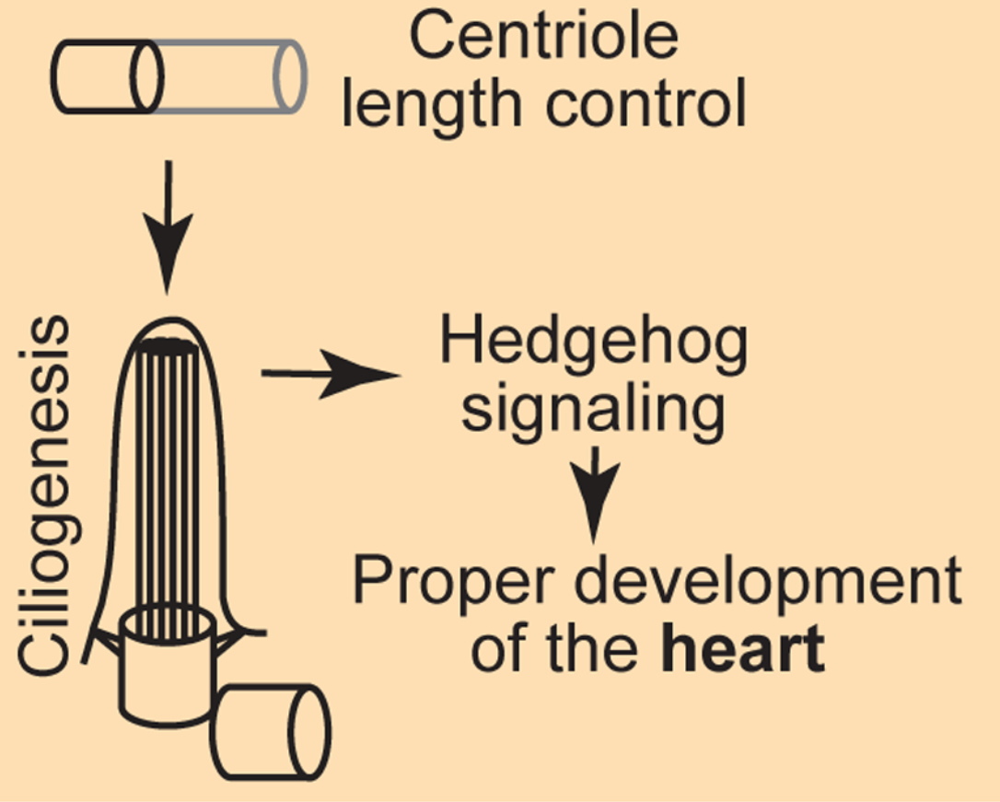

<figure style="text-align: center; margin: 2rem 0;">
  
  <figcaption style="font-size: 0.9em; color: #555; margin-top: 0.8rem; text-align: justify;">
    Working model: CEP97 and CDK1 cooperatively restrict centriole length to enable ciliogenesis and Hedgehog signaling, and thus proper heart and brain development.
</figure>

We are pleased to share our latest collaborative article, published in *Genes & Development*.

In this study we address a fundamental question about how cells build a complex organelle to precisely the right size. Centrioles are macromolecular assemblies that form the core of the centrosome and template the primary cilium, and their length must be tightly controlled for them to function properly.

Using a centrosome-specific phosphoproteomics approach (CAPture–phosphoMS) developed for this work, we map the phosphorylation landscape of the centrosome and identify cyclin-dependent kinase 1 (CDK1) as a key regulator of many centriolar proteins involved in length control, including Centrobin. We then show that CDK1 acts synergistically with the centriolar complex CEP97–CCP110: both restrict centriole elongation, but through distinct mechanisms. CEP97 limits the centriolar pool of Centrobin, while CDK1 directly phosphorylates Centrobin and suppresses its centriole-elongating activity.

The biological consequences of this dual control are striking. When centrioles are allowed to overelongate — either by inhibiting CDK1 or by removing CEP97 — cells fail to assemble proper primary cilia. In mouse embryos, loss of CEP97 leads to overelongated centrioles in specific tissues, defective ciliogenesis, attenuated Hedgehog signaling, and ultimately abnormal heart and brain development, including atrio–ventricular septal defects and microcephalic ventriculomegaly. Together, our findings illustrate how cell-cycle kinases and organelle-integral factors cooperate to keep organelle architecture within the narrow range required for development.

This work was led by Yue (Harry) Liu in the laboratory of [Jeremy F. Reiter](https://reitergroup.ucsf.edu) at the University of California, San Francisco, to whom the main credit for this project belongs. Our contribution was the acquisition of transmission electron microscopy data used to characterize centriole ultrastructure in wild-type and CEP97-deficient cells. We are truly grateful to Harry and Jeremy for involving us in this beautiful project, and we warmly congratulate Harry on this milestone and on starting his own laboratory at Stony Brook University.

**Reference**  
Liu Y, Wang Z, Sinha T, Li KH, Chalkley RJ, Herranz-Pérez V, Xie C, Yoder BK, Burlingame AL, Black BL, Reiter JF. *CDK1 and CEP97 cooperatively control centriole length to orchestrate ciliogenesis and developmental patterning*. *Genes & Development* (2026). DOI: https://doi.org/10.1101/gad.353426.125
